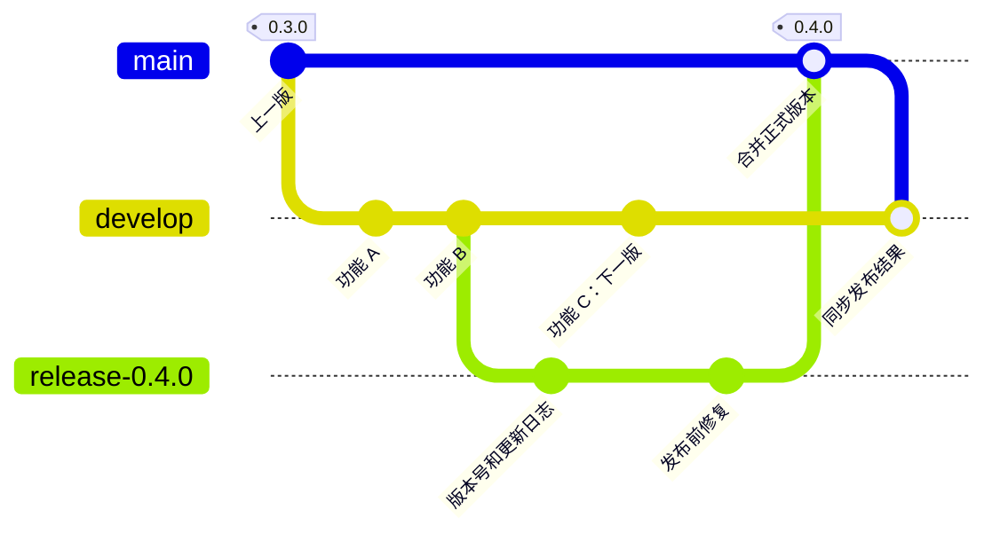

# Development and release workflow

**Status: planned, pending implementation.** The branch, merge, and environment
policies are agreed; the two-stage release automation below is recommended.
Current repository rules and automation continue to apply until activation.

Daily work will integrate on `develop`. A temporary release branch will freeze
each candidate for validation before promotion to `main`. Development, staging,
and production will remain available between releases.

## Branches and commits

Keep `main` and `develop`; create feature branches from the latest `develop`.
Cut each temporary `release-<version>` branch from a validated `develop` commit
and remove it only after its release is complete.

Direct pushes to `main`, `develop`, and `release-*` are prohibited, including
automation pushes. All subsequent updates must go through pull requests:

| Change | Pull request destination | Required merge method |
| --- | --- | --- |
| Daily development | `develop` | Squash |
| Version and changelog preparation; candidate fixes | `release-*` | Squash |
| Emergency hotfix branched from `main` | `main` | Squash |
| Release promotion from `release-*` | `main` | Merge commit |
| Synchronization between `main`, `develop`, and an active `release-*` | The branch being synchronized | Merge commit |

Ordinary development pull requests must target `develop`. Only hotfixes and
release promotion may target `main`. Never squash or rebase promotion or
synchronization pull requests: merge commits preserve the shared ancestry.
Propagate a merged hotfix from `main` to `develop` and any active release branch
through synchronization pull requests, then repeat candidate validation.

A true fast-forward would also preserve ancestry, but GitHub's standard pull
request merge uses `--no-ff`. This workflow therefore uses merge commits for
promotion and synchronization; it does not use direct pushes for fast-forwarding.
See [GitHub's merge methods](https://docs.github.com/en/repositories/configuring-branches-and-merges-in-your-repository/configuring-pull-request-merges/about-merge-methods-on-github).

Each point below is a commit. Feature C belongs to the next release while
`0.4.0` includes features A and B and the release fix.

## Permanent environments and domains

| Environment | Deployment source | Website | Web API and MCP |
| --- | --- | --- | --- |
| Production | Validated `main` | `packetrove.com` | `api.packetrove.com` |
| Development | Latest validated `develop` | `dev.packetrove.com` | `api.dev.packetrove.com` |
| Staging | Active release candidate; otherwise the successfully released `main` revision | `staging.packetrove.com` | `api.staging.packetrove.com` |

Each website will call its own environment's API. MCP will use `/mcp` on the
corresponding API hostname. Environment configuration will remain separate even
when staging and production run the same source revision.

Staging will stay on the candidate during acceptance. Updates to `develop` or
`main` must not overwrite it. After publication succeeds, deploy the released
`main` revision to staging and keep all three environments and their domains.

Cloudflare Workers Custom Domains issue certificates for multi-level hostnames
without a separate Advanced Certificate Manager subscription. See
[Cloudflare's certificate documentation](https://developers.cloudflare.com/workers/configuration/routing/custom-domains/#certificates).

## Recommended manual release

Use pull requests for branch changes and a manually started GitHub Action to
coordinate them. Two stages keep candidate preparation separate from the
decision to publish:

1. **Prepare:** The owner selects a validated `develop` SHA. The Action creates
   `release-<version>` at that commit, prepares the version and changelog on a
   separate branch using the latest formal release as the baseline, and opens
   a pull request into the release branch. The Action squash-merges it after
   required checks.
2. The Action deploys the candidate to staging and opens a promotion pull request
   to `main`. Apply candidate fixes through squash pull requests. Development
   continues on `develop`. Record the accepted candidate SHA and `main` baseline.
   Changes to either require renewed checks and staging acceptance before promotion.
3. **Publish:** After staging acceptance, the owner starts the Action for that
   candidate and its promotion pull request. The Action verifies the recorded
   revisions and latest required checks, then merges the pull request with a
   merge commit. This trigger authorizes publication of that candidate.
4. Deploy and verify the resulting `main` revision. After success, tag that exact
   revision, create its GitHub Release, and publish the CLI at the same version.
5. Deploy the released revision to staging. The Action opens a synchronization
   pull request to `develop` and merges it with a merge commit after checks.
   Remove the completed release branch after synchronization succeeds.

Allow one active candidate at a time. Preparing or correcting a candidate does
not publish a version. Keep a partially completed release pending and retry the
same revision and artifacts; do not advance the version merely because a step
failed. Published versions are immutable, and subsequent code changes require a
new version.

## Implementation work

Activation requires checks and protection for all three branch patterns, the
three environment configurations, and the two release stages. Enable squash and
merge commits, disable rebase merging, and update contributor instructions.

GitHub's native merge-method rules apply to target branches, so they cannot
enforce this table by pull request type. A routing check can reject an invalid
destination, but cannot prevent someone choosing the wrong merge method. For
strict enforcement, restrict protected-branch merges to trusted automation that
chooses the method for each change type. Keep pull requests and required checks
mandatory for that automation. This merge-entry restriction remains an
implementation decision. See [GitHub's ruleset reference](https://docs.github.com/en/repositories/configuring-branches-and-merges-in-your-repository/managing-rulesets/available-rules-for-rulesets).

The current procedures remain documented in the
[CI guide](continuous-integration.md), [deployment guide](deployment.md), and
[publishing guide](cli-publishing.md).
