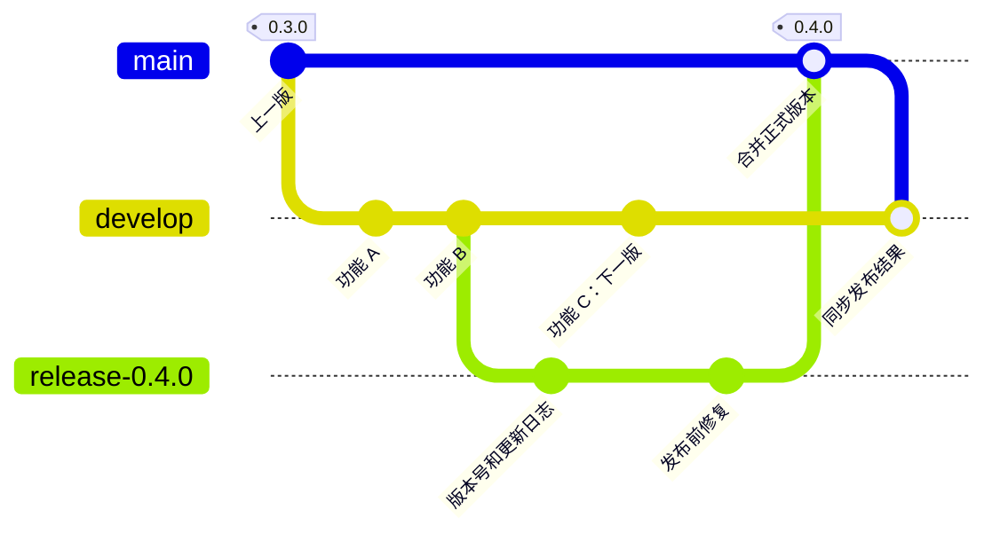

# Development and release workflow

**Status: agreed design, pending implementation.** Current repository rules and
automation continue to apply until this workflow is implemented.

Daily work will integrate on `develop`. A temporary release branch will freeze
each candidate for validation before promotion to `main`. Development, staging,
and production will remain available between releases.

## Branches and commits

Create feature branches from the latest `develop` and squash-merge feature pull
requests into it. Promote release branches to `main` using merge commits, then
synchronize `main` back into `develop` through a pull request with a merge commit.
This preserves the relationship between the long-running branches. Keep `main`
and `develop`; remove a release branch only after its release is complete.

Each point below is a commit. Feature C belongs to the next release while
`0.4.0` includes features A and B and the release fix.

## Permanent environments and domains

| Environment | Deployment source | Website | Web API and MCP |
| --- | --- | --- | --- |
| Production | Validated `main` | `packetrove.com` | `api.packetrove.com` |
| Development | Latest validated `develop` | `dev.packetrove.com` | `api.dev.packetrove.com` |
| Staging | Active release candidate; otherwise the successfully released `main` revision | `staging.packetrove.com` | `api.staging.packetrove.com` |

Each website will call its own environment's API. MCP will use `/mcp` on the
corresponding API hostname. Environment configuration will remain separate even
when staging and production run the same source revision.

Staging will stay on the candidate during acceptance. Updates to `develop` or
`main` must not overwrite it. After publication succeeds, deploy the released
`main` revision to staging and keep all three environments and their domains.

Cloudflare Workers Custom Domains issue certificates for multi-level hostnames
without a separate Advanced Certificate Manager subscription. See
[Cloudflare's certificate documentation](https://developers.cloudflare.com/workers/configuration/routing/custom-domains/#certificates).

## Manual release

1. The owner starts the release Action for a validated `develop` commit. Record
   its full SHA, create a temporary release branch, and prepare one product
   version and changelog using the latest formal release as the baseline.
2. Deploy the candidate to staging. Apply candidate fixes through pull requests
   and repeat validation. Development can continue independently on `develop`.
3. Promote the exact candidate that passed staging validation through a release
   pull request to `main`. Require the latest checks and an up-to-date branch;
   merge with a merge commit.
4. Deploy and verify production. After success, tag the exact `main` revision,
   create its GitHub Release, and publish the CLI to npm at the same version.
5. Deploy that released revision to staging, synchronize `main` into `develop`,
   and remove the completed release branch.

Allow one active candidate at a time. Preparing or correcting a candidate does
not publish a version. Keep a partially completed release pending and retry the
same revision and artifacts; do not advance the version merely because a step
failed. Published versions are immutable, and subsequent code changes require a
new version.

## Implementation work

Activation requires development-branch checks and protection, the three
environment configurations, and separation of version preparation from formal
publication. Update the repository merge settings, `main` ruleset, and contributor
instructions to permit the promotion merge commits while retaining pull requests
and required checks. The current procedures remain documented in the
[CI guide](continuous-integration.md), [deployment guide](deployment.md), and
[publishing guide](cli-publishing.md).
