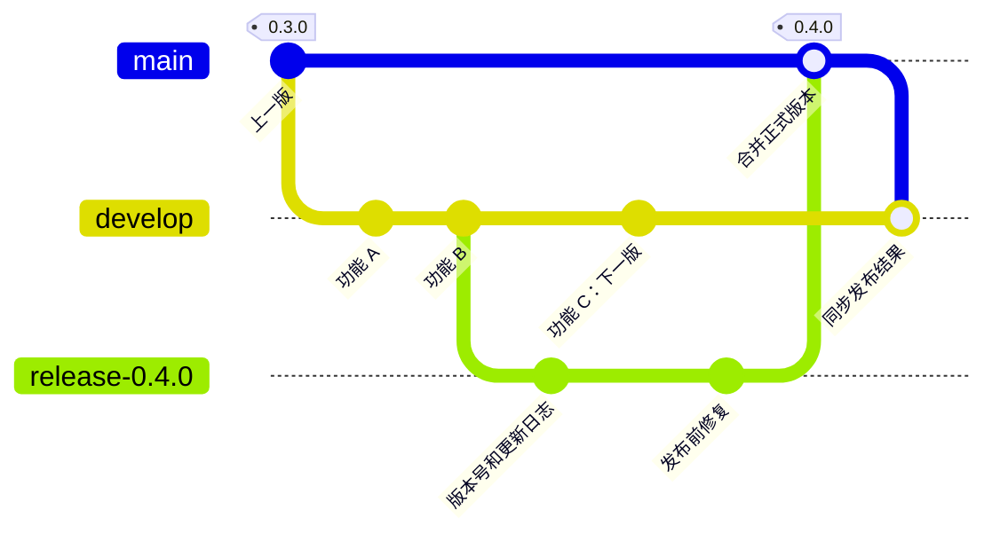

# Development and release workflow

**Status: agreed target policy, pending implementation.** The branches, merge
methods, and environments below are agreed. Release orchestration and strict
merge-method enforcement remain proposals. Current repository rules and
automation continue to apply during migration.

Daily work will integrate on `develop`. A temporary release branch will freeze
each candidate for validation before promotion to `main`. Development, staging,
and production will remain available between releases.

## Branches and commits

Keep `main` and `develop`; create feature branches from the latest `develop`.
Cut each temporary `release-<version>` branch from a validated `develop` commit
and remove it only after its release is complete.

Do not push directly to `main`, `develop`, or `release-*`. Ordinary development,
release fixes, and hotfixes must use pull requests:

| Change | Destination branch | Required merge method |
| --- | --- | --- |
| Daily development | `develop` | Squash |
| Pre-release fixes | `release-*` | Squash |
| Emergency hotfix branched from `main` | `main` | Squash |
| Release promotion from `release-*` | `main` | Merge commit, or a true fast-forward when possible |
| Synchronization between `main`, `develop`, and an active `release-*` | The branch being synchronized | Merge commit, or a true fast-forward when possible |

Ordinary development pull requests must target `develop`; direct change pull
requests to `main` are reserved for hotfixes. Never squash or rebase merges
between `main`, `develop`, and `release-*`: preserve their shared ancestry.
Whether release promotion and synchronization also require pull requests is
an open orchestration decision, distinct from these agreed merge methods.

A true fast-forward is permitted by the target policy. GitHub's standard pull
request merge uses `--no-ff` and therefore creates a merge commit. A future
fast-forward implementation must follow the approved release route and branch
protections; the exception does not authorize direct pushes or bypasses.
See [GitHub's merge methods](https://docs.github.com/en/repositories/configuring-branches-and-merges-in-your-repository/configuring-pull-request-merges/about-merge-methods-on-github).

Each point below is a commit. Feature C belongs to the next release while
`0.4.0` includes features A and B and the release fix.

## Permanent environments and domains

| Environment | Deployment source | Website | Web API and MCP |
| --- | --- | --- | --- |
| Production | Validated `main` | `packetrove.com` | `api.packetrove.com` |
| Development | Latest validated `develop` | `dev.packetrove.com` | `api.dev.packetrove.com` |
| Staging | Active release candidate; otherwise the successfully released `main` revision | `staging.packetrove.com` | `api.staging.packetrove.com` |

Each website will call its own environment's API. MCP will use `/mcp` on the
corresponding API hostname. Environment configuration will remain separate even
when staging and production run the same source revision.

Staging will stay on the candidate during acceptance. Updates to `develop` or
`main` must not overwrite it. After publication succeeds, deploy the released
`main` revision to staging and keep all three environments and their domains.

Cloudflare Workers Custom Domains issue certificates for multi-level hostnames
without a separate Advanced Certificate Manager subscription. See
[Cloudflare's certificate documentation](https://developers.cloudflare.com/workers/configuration/routing/custom-domains/#certificates).

## Recommended manual release

**Proposal, not yet selected.** Use pull requests for branch changes and a
manually started GitHub Action to coordinate them. The requirement to use
release and synchronization pull requests, two manual triggers, and automatic
PR merging have not been agreed. In this proposed flow, two stages separate
candidate preparation from the decision to publish:

1. **Prepare:** The owner selects a validated `develop` SHA. The Action creates
   `release-<version>` at that commit, prepares the version and changelog on a
   separate branch using the latest formal release as the baseline, and opens
   a pull request into the release branch. The Action squash-merges it after
   required checks.
2. The Action deploys the candidate to staging and opens a promotion pull request
   to `main`. Apply candidate fixes through squash pull requests. Development
   continues on `develop`. Record the accepted candidate SHA and `main` baseline.
   Changes to either require renewed checks and staging acceptance before promotion.
3. **Publish:** After staging acceptance, the owner starts the Action for that
   candidate and its promotion pull request. The Action verifies the recorded
   revisions and latest required checks, then merges the pull request with a
   merge commit. This trigger authorizes publication of that candidate.
4. Deploy and verify the resulting `main` revision. After success, tag that exact
   revision, create its GitHub Release, and publish the CLI at the same version.
5. Deploy the released revision to staging. The Action opens a synchronization
   pull request to `develop` and merges it with a merge commit after checks.
   Remove the completed release branch after synchronization succeeds.

The proposed recovery flow also synchronizes a merged hotfix from `main` into
`develop` and any active release branch through ordinary merge pull requests,
then repeats candidate validation. Acceptance tied to specific revisions and
this hotfix synchronization procedure are proposed implementation details.

Allow one active candidate at a time. Preparing or correcting a candidate does
not publish a version. Keep a partially completed release pending and retry the
same revision and artifacts; do not advance the version merely because a step
failed. Published versions are immutable, and subsequent code changes require a
new version.

## Implementation work

CI now validates `main`, `develop`, and `release-*`, while production deploys
only from `main`. Named Worker configurations and the environment deployment
workflow support development and staging; activate automatic deployment only
after bootstrap verification. Legacy release-please defaults to finalizing an
owner-merged PR; preparing another legacy candidate requires explicit manual
selection. Complete the transition in this order:

1. Extend validation to pull requests targeting `develop` and `release-*`,
   retaining `Validate project` and keeping PR validation separate from deployment.
2. Add development and staging configurations for both Workers. Parameterize
   website and API origins, MCP Host and Origin validation, and live checks.
   Deploy validated `develop` revisions to development. Keep staging on the
   selected candidate during acceptance and on the released revision afterward.
   Verify each environment against its own domains before routing daily work to it.
3. Select the release orchestration, then separate candidate version preparation
   from formal publication. Reuse the existing unified-version generators and
   npm publication checks; replace the automatic `main` preparation trigger at
   cutover so old and new automation cannot prepare competing releases.
4. At the approved cutover, resolve outstanding legacy release-please PRs before
   protecting `release-*`; their branch names also match that pattern. Enable
   squash and merge commits, disable rebase merging, and apply protection and
   required checks using the approved release route. Create `develop` from
   validated `main`, switch ordinary development to it, and update the
   transitional contributor rules.
5. Exercise a complete release, concurrent development for the next version,
   hotfix recovery, and a failed-step retry. Verify production publication,
   staging's return to the released revision, and synchronization into `develop`.

Strict enforcement of merge methods can be a separate step after this flow is
working. Selecting a sole automated merger is an additional owner decision.

GitHub's native merge-method rules apply to target branches, so they cannot
enforce this table by pull request type. A routing check can reject an invalid
destination, but cannot prevent someone choosing the wrong merge method. For
strict enforcement, restrict protected-branch merges to trusted automation that
chooses the method for each change type. Keep pull requests and required checks
mandatory for that automation. This merge-entry restriction remains an
implementation decision. See [GitHub's ruleset reference](https://docs.github.com/en/repositories/configuring-branches-and-merges-in-your-repository/managing-rulesets/available-rules-for-rulesets).

The current procedures remain documented in the
[CI guide](continuous-integration.md), [deployment guide](deployment.md), and
[publishing guide](cli-publishing.md).
