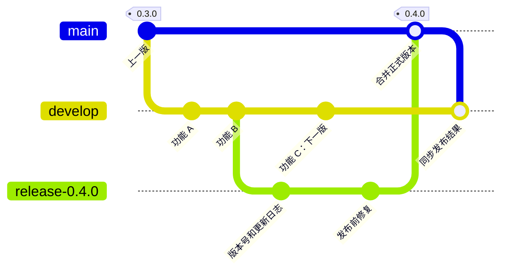

# Development and release workflow

**Status: active.** Required PRs, CI, the manual release coordinator, and all
three permanent environments are enabled. Human maintainers still choose merge
methods according to the policy below; a sole automated merger is not required.

Daily work integrates on `develop`. A temporary release branch freezes
each candidate for validation before promotion to `main`. Development, staging,
and production remain available between releases.

## Branches and commits

Keep `main` and `develop`; create feature branches from the latest `develop`.
Cut each temporary `release-<version>` branch from a validated `develop` commit
and remove it only after its release is complete.

Do not push directly to `main`, `develop`, or `release-*`. Ordinary development,
release fixes, and hotfixes must use pull requests:

| Change | Destination branch | Required merge method |
| --- | --- | --- |
| Daily development | `develop` | Squash |
| Pre-release fixes | `release-*` | Squash |
| Emergency hotfix branched from `main` | `main` | Squash |
| Release promotion from `release-*` | `main` | Merge commit, or a true fast-forward when possible |
| Synchronization between `main`, `develop`, and an active `release-*` | The branch being synchronized | Merge commit, or a true fast-forward when possible |

Ordinary development pull requests must target `develop`; direct change pull
requests to `main` are reserved for hotfixes. Never squash or rebase merges
between `main`, `develop`, and `release-*`: preserve their shared ancestry.
The manual release coordinator also uses pull requests for promotion and
synchronization. It waits for checks and selects the required merge method;
it has no branch-protection bypass.

A true fast-forward is permitted by the target policy. GitHub's standard pull
request merge uses `--no-ff` and therefore creates a merge commit. A future
fast-forward implementation must follow the approved release route and branch
protections; the exception does not authorize direct pushes or bypasses.
See [GitHub's merge methods](https://docs.github.com/en/repositories/configuring-branches-and-merges-in-your-repository/configuring-pull-request-merges/about-merge-methods-on-github).

Each point below is a commit. Feature C belongs to the next release while
`0.4.0` includes features A and B and the release fix.

## Permanent environments and domains

| Environment | Deployment source | Website | Web API and MCP |
| --- | --- | --- | --- |
| Production | Validated `main` | `packetrove.com` | `api.packetrove.com` |
| Development | Latest validated `develop` | `dev.packetrove.com` | `api.dev.packetrove.com` |
| Staging | Active release candidate; otherwise latest validated `main` | `staging.packetrove.com` | `api.staging.packetrove.com` |

Each website calls its own environment's API. MCP uses `/mcp` on the
corresponding API hostname. Environment configuration remains separate even
when staging and production run the same source revision.

Staging will stay on the candidate during acceptance. Updates to `develop` or
`main` must not overwrite it. After publication succeeds, deploy the released
`main` revision to staging and keep all three environments and their domains.

Cloudflare Workers Custom Domains issue certificates for multi-level hostnames
without a separate Advanced Certificate Manager subscription. See
[Cloudflare's certificate documentation](https://developers.cloudflare.com/workers/configuration/routing/custom-domains/#certificates).

## Manual release

Run **Manual Packetrove release** on `main`. Its two stages separate candidate
preparation from acceptance and publication. The action uses the repository's
release App, retains required checks, and records every created or merged PR
in its run summary. Candidate preparation and publication have separate
authorization boundaries.

### Release approval

Before each release, the agent must present the version, full candidate or PR
head SHA, PR link, change scope, applicable validation and staging results, and
production impact, then ask for and receive separate explicit owner approval.
Complete the work and applicable checks first. For a candidate release, include
successful staging verification; for a hotfix, identify any checks that can only
run after deployment.

Approval of a design, implementation or rollout plan, "Implement the plan",
"proceed", or an ordinary feature PR merge is not release approval. The owner
must approve the reviewed release before promotion or any hotfix or
release-metadata PR merge into `main`, because main CI automatically deploys
production. Dispatching `publish` or supplying `accepted_sha` cannot substitute
for that approval.

Approval covers one reviewed version, candidate and rollout scope. Changed
candidate commits or scope require renewed approval. The resulting promotion
merge commit and subsequent deployment, tags, GitHub Release, CLI publication,
synchronization, cleanup and retries of the same approved artifacts can proceed
without another confirmation. Preparation alone does not authorize publication.

This rule governs agents; the current GitHub PR rules require zero approving
reviews and the release workflow has no separate required human approval gate.

### Preparation and publication

1. **Prepare:** Choose `action=prepare` and an explicit next stable `version`.
   Optionally select a validated `develop` `source_sha`; otherwise use its current
   head. The Action creates
   `release-<version>` at that commit, prepares the version and changelog on a
   separate branch using the latest formal release as the baseline, and opens
   a pull request into the release branch. The Action squash-merges it after
   required checks.
2. The Action deploys the candidate to staging and opens a promotion pull request
   to `main`. Apply candidate fixes through squash pull requests, including
   relevant changelog additions. Development continues on `develop`. Record the
   accepted candidate SHA. New candidate commits require renewed acceptance;
   new `main` commits must first be synchronized into the candidate.
3. **Publish:** After staging acceptance and explicit owner release approval,
   run `action=publish` with the same
   `version` and the full 40-character `accepted_sha`. The Action verifies the recorded
   revisions and latest required checks, then merges the pull request with a
   merge commit and executes the approved publication of that candidate.
4. Deploy and verify the resulting `main` revision. After success, tag that exact
   revision, create its GitHub Release, and publish the CLI at the same version.
5. The Action opens a synchronization
   pull request to `develop` and merges it with a merge commit after checks.
   Remove the completed release branch after synchronization succeeds, then
   deploy validated `main` to staging.

For an emergency, squash-merge a hotfix PR from current `main` into `main` and
add the `hotfix` label. Use `prepare-hotfix` to prepare the next patch version
through another squash PR into `main`; after production validation, run
`publish-hotfix` with that exact `main` SHA. The workflow publishes it and
synchronizes `main` into `develop` and any active candidate. An active candidate
must have a higher version than the hotfix and must be accepted again afterward.

Main CI also starts synchronization after successful validation when its version
matches the latest published release. Run `action=synchronize` to recover a
pending synchronization explicitly. If there are conflicts, resolve them on a
temporary `automation/sync-*` branch created from the destination. Merge `main`
into that branch normally, resolve conflicts, and merge its PR into the destination
with a merge commit. Preserve the candidate's higher version and both changelog
sections; regenerate versioned documents. Never pull unreleased destination
changes into `main` to make a synchronization PR mergeable.

Allow one active candidate at a time. Preparing or correcting a candidate does
not publish a version. Keep a partially completed release pending and retry the
same revision and artifacts; do not advance the version merely because a step
failed. Published versions are immutable, and subsequent code changes require a
new version.

Preparation accepts the immediate next patch, minor, or major version after the
highest published stable release. A hotfix accepts only the immediate patch.
This permits `0.4.0` to `0.5.0` for a feature release without treating unpublished
patch numbers as skipped releases. Once a candidate exists, retry preparation
without `source_sha`; use fix PRs to change that candidate. Retry failed
publication with the same version. Tags and existing npm archives cannot be
moved or replaced. The coordinator retries a failed CLI workflow once; further
recovery uses the existing tag through **Publish CLI to npm**.

## Repository enforcement

`DEVELOPMENT_WORKFLOW_ENABLED=true` enables release coordination and PR routing.
`NON_PRODUCTION_DEPLOYMENTS_ENABLED=true` enables development and staging after
successful branch CI. The old **Prepare Packetrove release** workflow is disabled;
its final `0.4.0` release is published and has no successor candidate.

Active rulesets protect `main`, `develop`, and `release-*`. Each requires a PR,
`Validate project` from GitHub Actions, and no force pushes. There are no bypass
actors, including administrators or the release App. `main` and `develop` cannot
be deleted; the coordinator deletes a completed release branch only after its
changes are promoted, published, and synchronized. Repository and target-branch
rules allow squash and merge commits and disable rebase merging.

The routing check, enabled by `DEVELOPMENT_WORKFLOW_ENABLED=true`, rejects
ordinary PRs into `main`; it permits release promotion or a declared hotfix.
It validates unified versions for promotion PRs. Keep `main`'s requirement to
be up to date. Required checks on `develop` and `release-*` need not require
the source branch to contain their head: synchronization must not add unreleased
work to `main`. The coordinator checks the PR head and destination revision
again immediately before merging.

Strict enforcement of merge methods can be a separate step after this flow is
working. Selecting a sole automated merger is an additional owner decision.

GitHub's native merge-method rules apply to target branches, so they cannot
enforce this table by pull request type. A routing check can reject an invalid
destination, but cannot prevent someone choosing the wrong merge method. For
strict enforcement, restrict protected-branch merges to trusted automation that
chooses the method for each change type. Keep pull requests and required checks
mandatory for that automation. This merge-entry restriction remains an
implementation decision. See [GitHub's ruleset reference](https://docs.github.com/en/repositories/configuring-branches-and-merges-in-your-repository/managing-rulesets/available-rules-for-rulesets).

Detailed procedures are documented in the
[CI guide](continuous-integration.md), [deployment guide](deployment.md), and
[publishing guide](cli-publishing.md).
